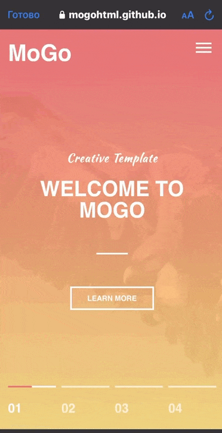
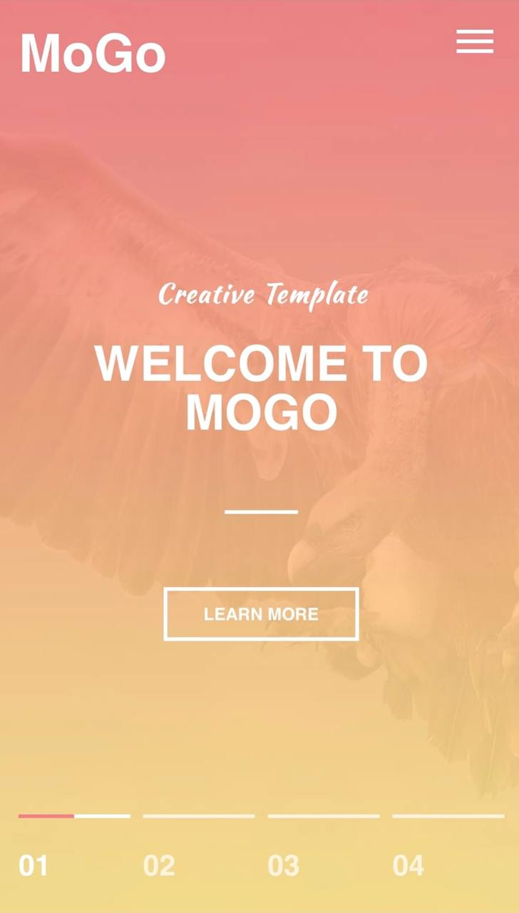
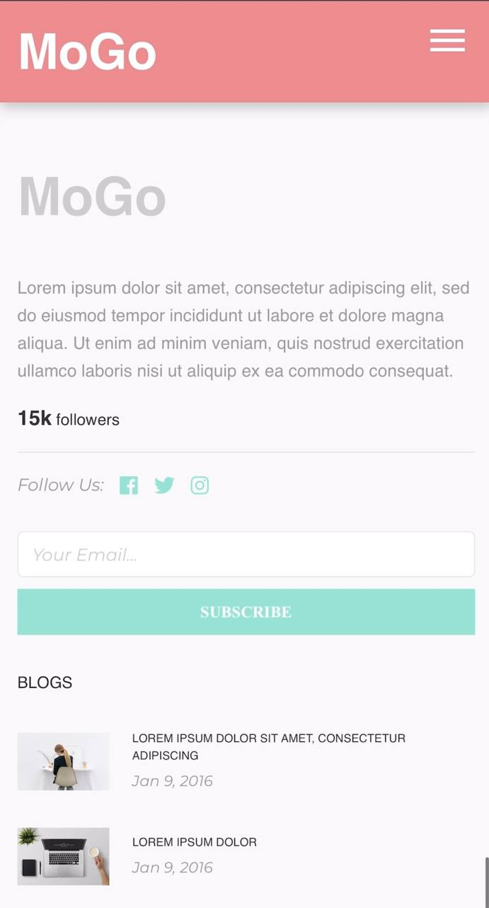
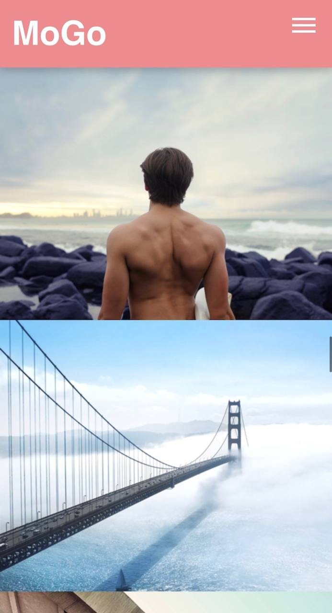
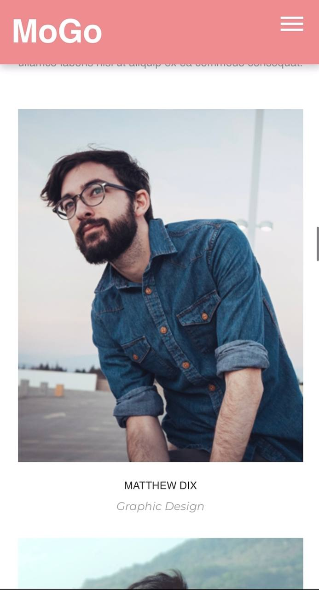
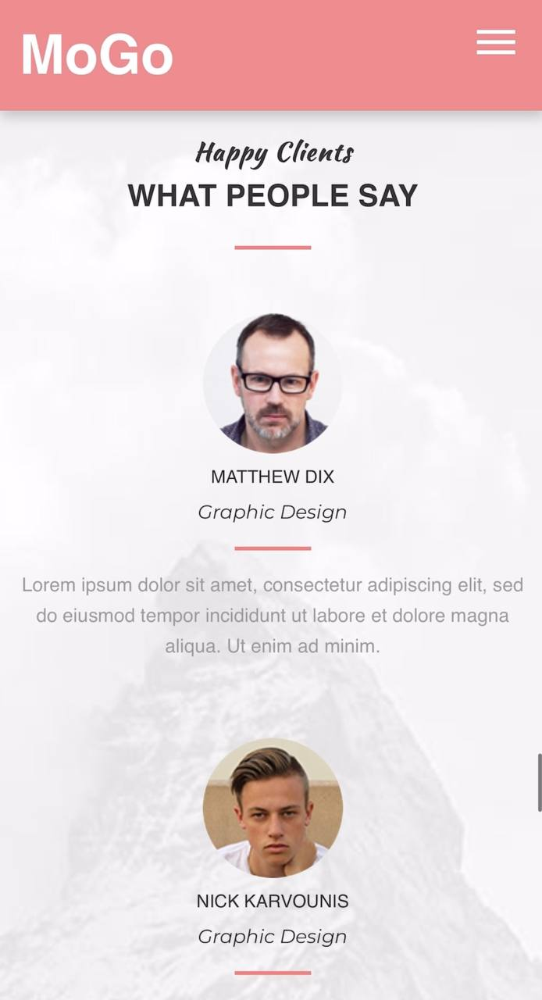
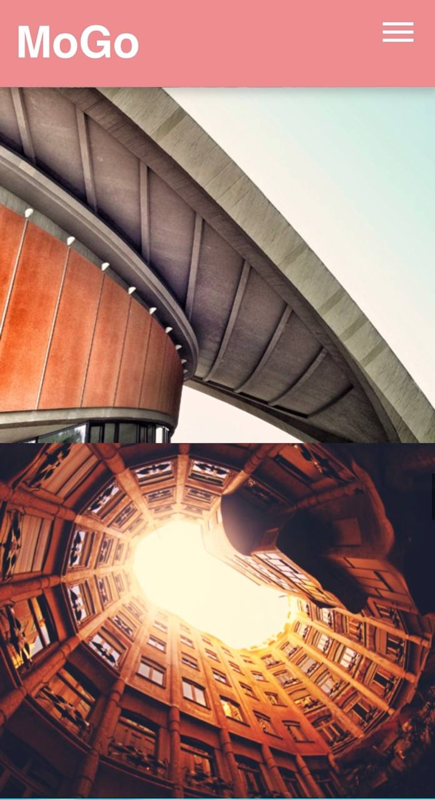

# Сайт 🎶😎Mogo - это дизайнерский сайт который взял в качестве шаблона и решил его реализовать. Взялся за этот проект ради того чтобы попрактиковать свои навыки в верстке на HTML | CSS | JavaScript. Также я получил колосальный опыт что мотивирует меня продолжать творить!

Не забудьте отметить "репост", если вам понравился сайт
# 🎥 Презентация

# 📸 Скриншоты

| 1 | 2|
|------|-------|
|||

| 3 | 4|
|------|-------|
|||

| 5 | 6|
|------|-------|
|||

